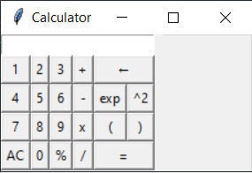

# CALCULATOR
_This practice is a simple calculator made with python_

## Built with 🛠️

* [Python](https://www.python.org/) - A programming language that lets you work quickly and integrate systems more effectively.
* [TkInter](https://github.com/molefrog/wouter) - Is Python's de-facto standard GUI (Graphical User Interface) package.

